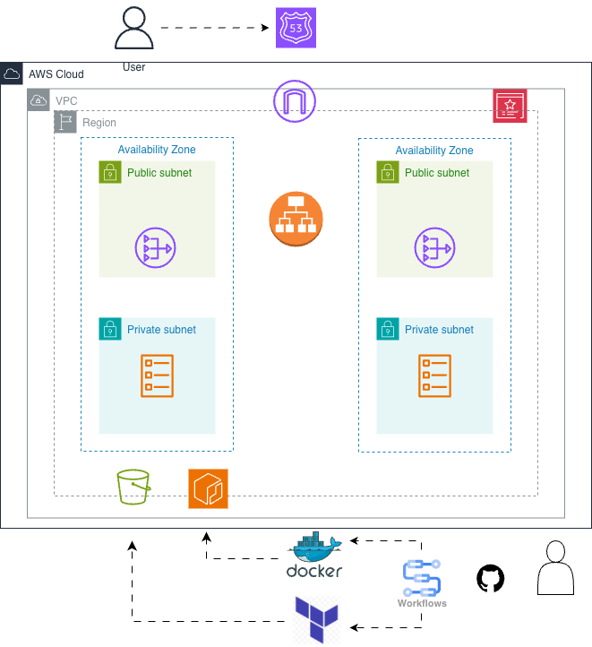

# Threat Composer | ECS Project
<!-- Project badges -->


## Description

The objective of the project was to containerise and deploy an application using Docker, Terraform and ECS Fargate using HTTPS and a custom domain.


## Architecture



The infrastructure is designed for high availability, security, and scalability.

Key components:
-	VPC with public and private subnets across multiple AZs
-	Application Load Balancer (ALB) in public subnets
-	ECS Fargate service running tasks in private subnets
-	NAT Gateway for outbound internet access from private subnets
-	ACM certificate for HTTPS
-	Route 53 + Cloudflare for DNS
-	S3 + DynamoDB remote Terraform state backend
-	GitHub Actions for CI/CD using OIDC


## Live URL:
👉 https://tm.zaitech.uk 


## 📌 Overview

ThreatComposer ECS is a DevOps-driven deployment of the ThreatComposer application using **AWS ECS**. It is designed for scalability, security and automation.

This project focuses on:
- Containerized workloads 
- Infrastructure as Code
- CI/CD pipelines
---

## Features
- VPC, subnets, route tables
- Security groups
- Application Load Balancer and listeners
- ECS cluster, task definition and service
- IAM roles and policies
- ECR repository
- ACM certificate

## 📁 Repository Structure
```bash
├── app/                      
│   ├── Dockerfile
│   ├── nginx.config
│   └── ...
├── infra/                    
│   ├── backend.tf
│   ├── main.tf
│   ├── variables.tf
│   ├── outputs.tf
│   └── modules/
│       ├── vpc/
│       ├── security/
│       ├── alb/
│       ├── ecs/
│       └── ecr/
├── .github/
│   └── workflows/
│       ├── build.yml         
│       └── deploy.yml         
├── .gitignore
└── README.md
```


## How to Reproduce:

### Prerequisites
- AWS account
- Terraform
- Docker
- GitHub repository
- Domain managed via Route 53 and/or Cloudflare

### Steps
- Create an S3 bucket and DynamoDB table for the Terraform backend
- Configure an IAM role for GitHub Actions using OIDC
- Add the following GitHub repository secrets:
	- AWS_REGION
	- AWS_ROLE_ARN
	- ECR_REPOSITORY
	- DOMAIN_NAME
- Push the repository to GitHub
- CI/CD pipelines run automatically

## Future Improvements:
- Blue/gree deployment
- Auto-scaling policies
- CloudWatch monitoring and alarms
- AWS WAF integration
- Secrets Manager for application secrets