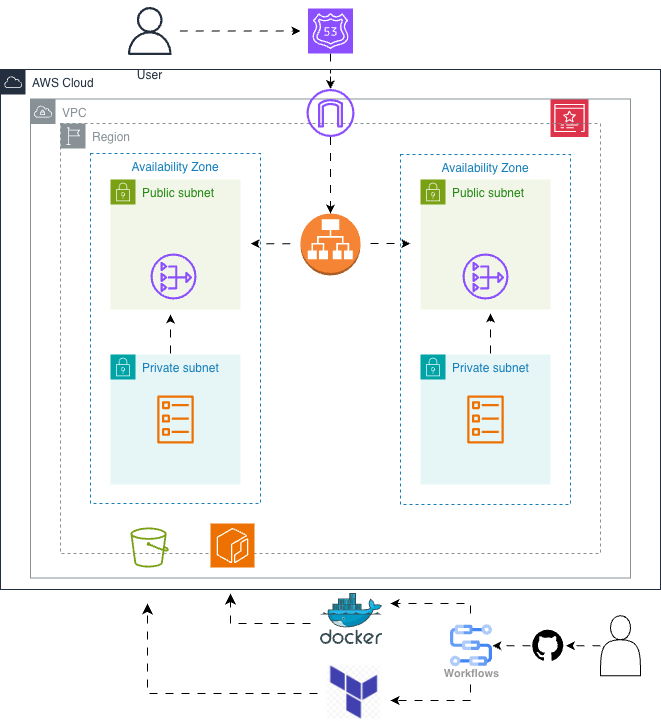
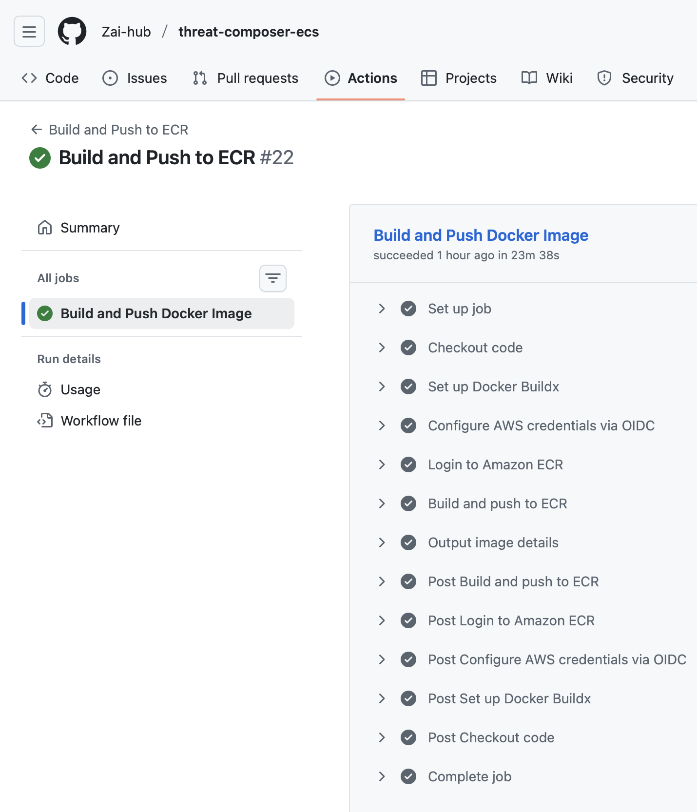
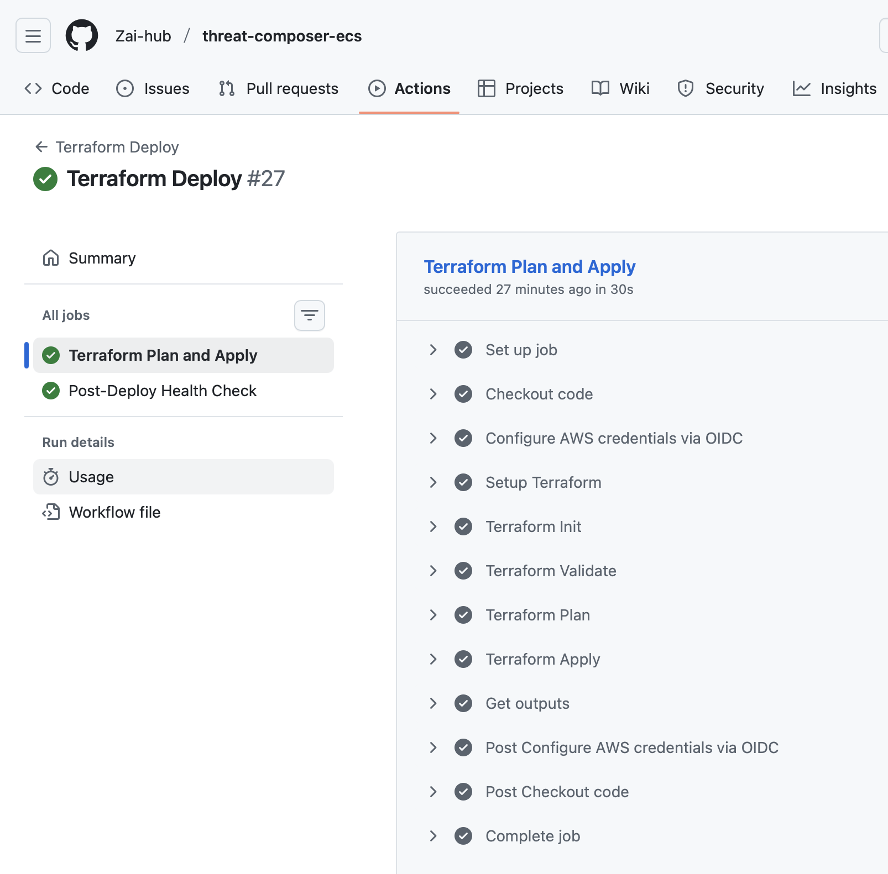
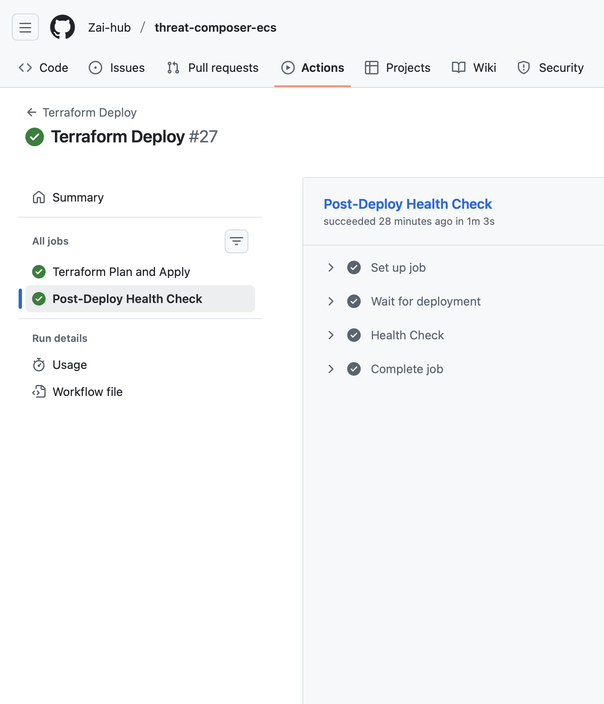

# Threat Composer | ECS Project
<!-- Project badges -->


## Table of Contents
- Description
- Architecture
- Repository Structure
- Reproduction Steps
- Infrastructure (Terraform)
- CI/CD Pipelines
- Challenges & Lessons Learned

## Description

The objective of the project was to containerise and deploy an application using Docker, Terraform and ECS Fargate using HTTPS and a custom domain.


## Architecture



The infrastructure is designed for high availability, security, and scalability.

Key components:
-	VPC with public and private subnets across multiple AZs
-	Application Load Balancer (ALB) in public subnets
-	ECS Fargate service running tasks in private subnets
-	NAT Gateway for outbound internet access from private subnets
-	ACM certificate for HTTPS
-	Route 53 + Cloudflare for DNS
-	S3 + DynamoDB remote Terraform state backend
-	GitHub Actions for CI/CD using OIDC


## Live URL:
👉 https://tm.zaitech.uk 


## 📌 Overview

ThreatComposer ECS is a DevOps-driven deployment of the ThreatComposer application using **AWS ECS**. It is designed for scalability, security and automation.

This project focuses on:
- Containerized workloads 
- Infrastructure as Code
- CI/CD pipelines
---

## Features
- VPC, subnets, route tables
- Security groups
- Application Load Balancer and listeners
- ECS cluster, task definition and service
- IAM roles and policies
- ECR repository
- ACM certificate

## 📁 Repository Structure
```bash
├── app/                      
│   ├── Dockerfile
│   ├── nginx.config
│   └── ...
├── infra/                    
│   ├── backend.tf
│   ├── main.tf
│   ├── variables.tf
│   ├── outputs.tf
│   └── modules/
│       ├── vpc/
│       ├── security/
│       ├── alb/
│       ├── ecs/
│       └── ecr/
├── .github/
│   └── workflows/
│       ├── build.yml         
│       └── deploy.yml         
├── .gitignore
└── README.md
```
 


## How to Reproduce:
The project was built incrementally, moving from local validation and moving to automated deployment.

### Prerequisites
- AWS account
- Terraform
- Docker
- GitHub repository
- Domain managed via Route 53 and/or Cloudflare

## 1. Application and Local Validation
- Cloned existing Threat Composer application repository.

- Local set up:
```bash
yarn install
yarn build
yarn global add serve
serve -s build

#yarn start
http://localhost:3000/workspaces/default/dashboard

## or
yarn global add serve
serve -s build
```

## 2. Containerisation
- Created a multi-stage Dockerfile inside the app.

- Built the image locally using:
```bash
docker built -t <image name> ./app
```

- Ran the container locally, mapping the container's port 80 to port 8080 on the host:
``` bash
docker run -p 8080:80 <image name>
```
- Verified container is running using curl:
``` bash
cult http://localhost:8080
```
- Image is ready to be pushed to ECR. 

## 3. Image Registry | AWS ECR
- Created an AWS ECR repository.

- Confirmed AWS credentials were configued:
``` bash
aws sts get-caller-identity
```
- Authenticated Docker to AWS ECR:
``` bash
aws ecr get-login-password --region <YOUR-REGION> \
| docker login --username AWS --password-stdin \
<YOUR AWS-ID>.dkr.ecr.<YOUR-REGION>.amazonaws.com
```

- Tagged image locally:
``` bash
docker tag <IMAGE-NAME:latest> \
<YOU-AWS-ID>.dkr.ecr.<YOUR-REGION>.amazonaws.com/<IMAGE-NAME>
```

- Pushed the image to ECR Repository:
``` bash
docker push \
<AWS-ID>.dkr.ecr.<YOUR-REGION>.amazonaws.com/<IMAGE-NAME>
```

## 4. ClickOps | Manual AWS Setup
- The main parts of the infrastructure were first created manually using the AWS console in order to understand how the services fit together.

- Created:
  - ECS Cluster (fargate).
  - Task definitions using the ECR Image.
  - Application Load Balancer.
  - Security Groups.
  - DNS Records.
  - ACM Certificate for HTTPS.

Once the application was reachable via HTTPS, all manual resources were deleted.

## 5. IaC | Terraform
I created the the setup using modular Terraform.

- Iniitialised Terraform in the directory:
```bash
terraform init
```

- Iteretively planned and applied infrastructure while building modules:
``` bash
terraform plan
terraform apply
```

- Verified infrastructure using the ALB DNS with HTTPS endpoint:
```bash
curl <ALB DNS>
curl https://<DOMAIN>
curl https://<DOMAIN>/health
```

- Destroyed infrastructure at the end:
``` bash
terraform destroy
```
## 6. CI/CD Automation
Implemented Github Actions for the pipelines.

### Build and Push



### Deploy and Post Health





### Challenges and Lessons Learned
I encountered many challenges during this project. The issues helped deepen my understanding.
- Commit often and early
- As a Mac user, I had issues running my image. I implemented ARM 64 in my clickops task definitions as well as terraform Iac. However, when it comes to building pipelines, this will slow down the build exponentially. Do not add it to you yaml files.
-
## Future Improvements:
- Blue/gree deployment
- Auto-scaling policies
- CloudWatch monitoring and alarms
- AWS WAF integration
- Secrets Manager for application secrets