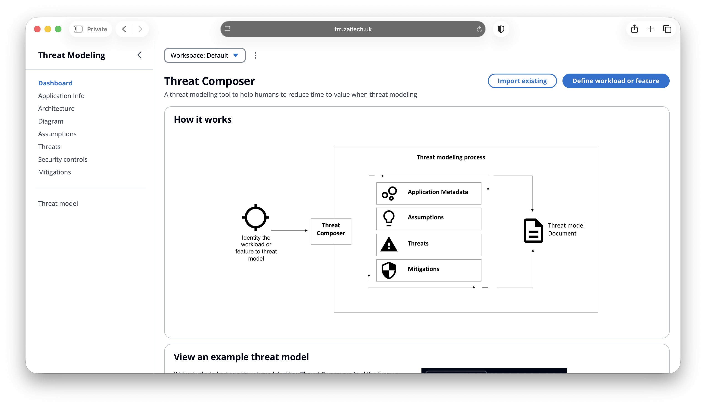

# Threat Composer | ECS Project
<!-- Project badges -->


## Description

The objective of the project was to containerise and deploy an application using Docker, Terraform and ECS Fargate using HTTPS and a custom domain.



## 📌 Overview

ThreatComposer ECS is a DevOps-driven deployment of the ThreatComposer application using **AWS ECS**. It is designed for scalability, security and automation.

This project focuses on:
- Containerised workloads 
- Infrastructure as Code
- CI/CD pipelines

---

## 🏗 Architecture

<!-- Architecture diagram -->


**High-level components:**
- AWS ECS (Fargate / EC2)
- Application Load Balancer
- Amazon ECR
- CloudWatch Logs
- IAM Roles
- VPC (public/private subnets)

---

## 🚀 Features

- Containerized ThreatComposer service
- ECS Task Definitions & Services
- Blue/Green or Rolling deployments
- Auto Scaling
- Secure networking
- Observability & logging

---

## 📁 Repository Structure

```text
.
├── app/                     # Application source
├── docker/                  # Dockerfiles
├── terraform/               # IaC modules
│   ├── ecs/
│   ├── vpc/
│   └── iam/
├── .github/workflows/       # CI/CD pipelines
├── docs/                    # Diagrams & documentation
└── README.md