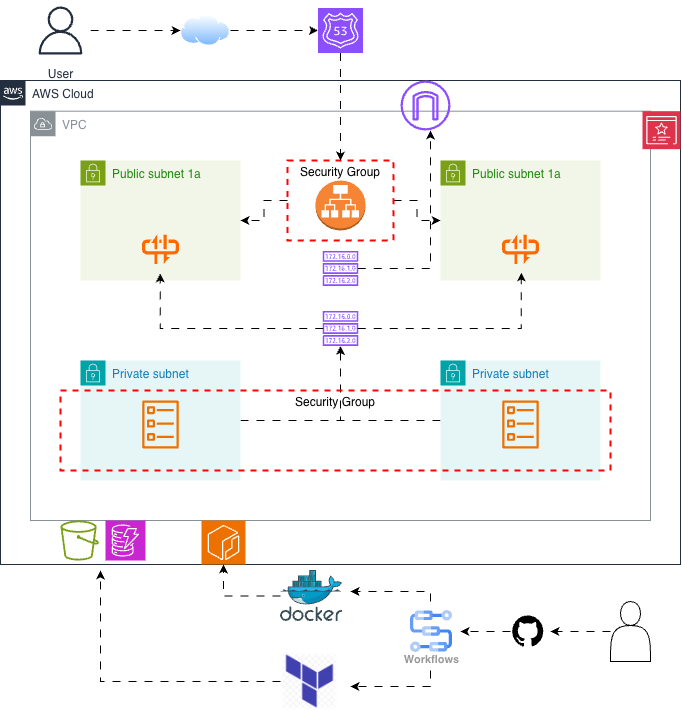

# Threat Composer | ECS Project
<!-- Project badges -->


## Description

The objective of the project was to containerise and deploy an application using Docker, Terraform and ECS Fargate using HTTPS and a custom domain.


## Architecture




## Deployed Application 


## 📌 Overview

ThreatComposer ECS is a DevOps-driven deployment of the ThreatComposer application using **AWS ECS**. It is designed for scalability, security and automation.

This project focuses on:
- Containerized workloads 
- Infrastructure as Code
- CI/CD pipelines
---

## Features

- Containerized ThreatComposer service
- ECS Task Definitions & Services
- Secure networking
- ECS Fargate

## 📁 Repository Structure

```text
.
├── app/            
├── ├──docker/             
├── terraform/              
│   ├── ecs/
│   ├── vpc/
│   └── iam/
├── .github/workflows/    
├── images/                   
└── README.md